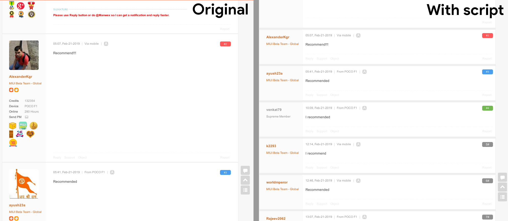

# Making MIUI Forums Usable

Makes the MIUI forums usable: much less cluttered, bloated and ugly. 

More specifically, this removes:
* Big medals
* Signatures
* More userdata under the profile
* Experience widget at the end of posts with the ratings
* Profile images
* Reduces margin between comments
* Annoying "Excellent" stamps

## Downloading the script
The direct download link is here:

* [GreasyFork](https://greasyfork.org/en/scripts/376119-making-miui-forums-usable)

**Chrome users:** you'll need a script manager extension like [TamperMonkey](https://addons.mozilla.org/en-US/firefox/addon/tampermonkey/) (the one I'm currently using) or [GreaseMonkey](https://addons.mozilla.org/en-US/firefox/addon/greasemonkey/). Then go to the download link above and click on 'Install X.X'. Finally, click on 'install' in the new window that will open.

**Firefox users:** you'll need a script manager extension like [TamperMonkey](https://chrome.google.com/webstore/detail/tampermonkey/dhdgffkkebhmkfjojejmpbldmpobfkfo?hl=en). Then go to the download link above and click on 'Install X.X'. Finally, click on 'install' in the new window that will open.

**Other browsers:** you can look for a script manager extension in your browser add-ons page. Look for Tampermonkey or Greasemonkey and install them. Then go to the download link above and click on 'Install X.X'. Finally, click on 'install' in the new window that will open.
